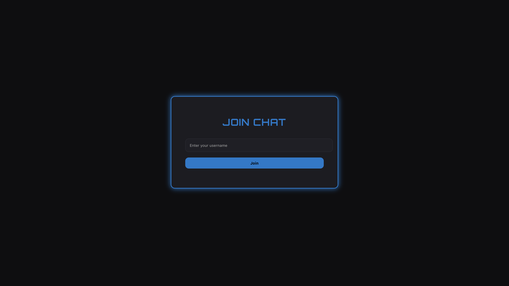
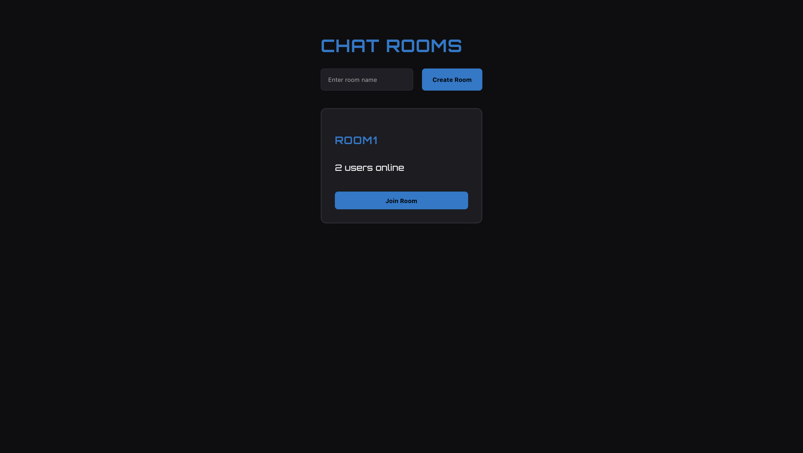
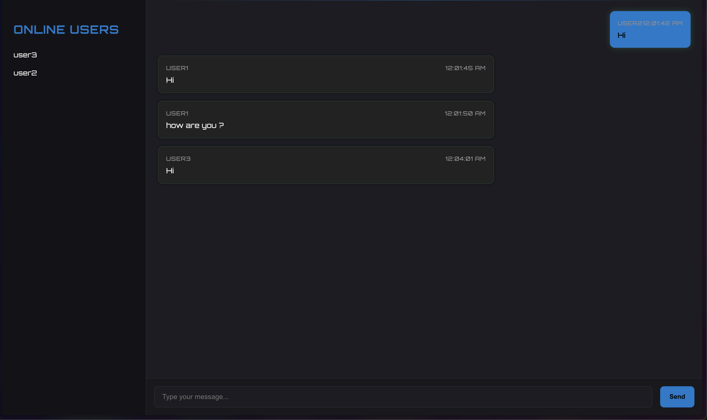

# Cyber Chat - Gaming-Themed Real-Time Chat Application

A modern, gaming-themed real-time chat application built with React, TypeScript, and Socket.IO. Features a sleek, futuristic design with neon accents and dark mode.



## ✨ Features

- Quick username-based authentication
- Multiple chat rooms support
- Real-time messaging
- Live user presence tracking
- Dynamic room creation
- Responsive design

## 🎯 Screenshots

### Login Screen


### Chat Rooms



### Live Chat



## 🚀 Getting Started

### Prerequisites

- Node.js (v14 or later)
- npm

### Installation

1. Clone the repository:

   ```bash
   git clone https://github.com/Avinash987/sample-chat.git
   cd sample-chat
   ```

2. Install frontend dependencies:

   ```bash
   npm install
   ```

3. Install server dependencies:
   ```bash
   cd server
   npm install
   cd ..
   ```

### Running the Application

1. Start both the client and server:
   ```bash
   npm run dev
   ```
   This will launch: [http://localhost:5173](http://localhost:5173)

## 🏗 Project Structure

```
src/
├── components/     # Reusable UI components
├── pages/         # Main page components
│   ├── Login.tsx       # Login screen
│   ├── ChatRooms.tsx  # Room listing
│   └── ChatRoom.tsx   # Chat interface
├── services/      # Backend services
└── App.tsx        # Main app component

server/            # Socket.IO backend
```

## 💻 Technologies Used

- **Frontend**

  - React with TypeScript
  - Socket.IO Client
  - Modern CSS with CSS Variables
  - Vite for blazing fast builds

- **Backend**
  - Node.js
  - Socket.IO
  - Express

## 🎨 UI/UX Features

- Smooth message animations
- Intuitive room navigation
- User presence indicators
- Responsive design for all devices
- Gaming-inspired color scheme
- Neon accent effects

## Technical Decisions

- Used **Vite** as the build tool for fast development and optimized production builds
- Implemented Socket.IO for real-time communication
- Used React Router for client-side routing
- Maintained a clean architecture with separate components for different features
- Used TypeScript for better type safety and development experience

## Future Improvements

- Add user authentication with JWT
- Implement persistent chat history
- Add private messaging functionality
- Add file sharing capabilities
- Implement user profiles with avatars
- Add message reactions and threading
- Implement room moderation features
